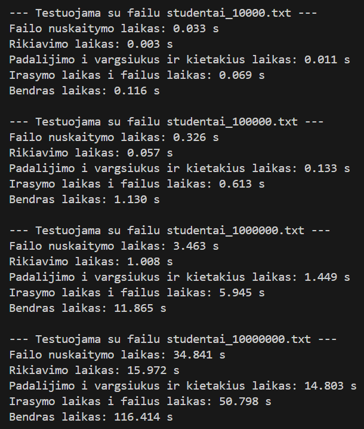
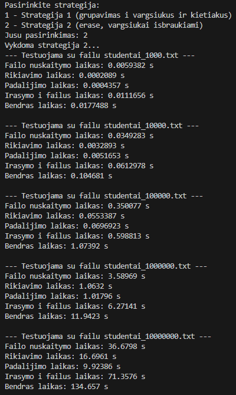
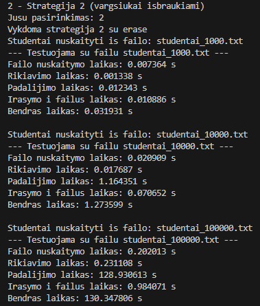

# Skirtingų strategijų analizės programa

## Strategijų tyrimas

Programa turi dvi strategijas studentų padalijimui pagal galutinį rezultatą:  

| Strategija | Aprašymas | Panaudota funkcija |
|------------|-----------|------------------|
| Strategija 1 | Padalijimas į kietakius ir vargšiukus pagal galutinį rezultatą >= 5  | `strategija1_list/strategija1_vector` |
| Strategija 2 | Padalijimas naudojant `erase` funkciją, kuri pašalina vargšiukus iš studentų failo | `strategija2_list/strategija2_vector` |

---

## Strategijos 1 pavyzdžiai

### Naudojant `std::list<Studentas>`
Matavimai atliekami sekundėmis

| Failas             | Nuskaitymas | Rikiavimas | Padalijimas | Įrašymas | **Bendras laikas** |
| ------------------ | ------------ | ----------- | ------------ | -------- | ------------------ |
| studentai_1000     | 0.007        | 0.000       | 0.001        | 0.008    | **0.017**          |
| studentai_10000    | 0.034        | 0.003       | 0.012        | 0.067    | **0.116**          |
| studentai_100000   | 0.327        | 0.056       | 0.133        | 0.611    | **1.127**          |
| studentai_1000000  | 3.379        | 0.970       | 1.411        | 6.839    | **12.620**         |
| studentai_10000000 | 34.220       | 15.929      | 14.842       | 51.843   | **116.233**        |

### Naudojant `std::vector<Studentas>`
Matavimai atliekami sekundėmis

| Failas             | Nuskaitymas | Rikiavimas | Padalijimas | Įrašymas | **Bendras laikas** |
| ------------------ | ------------ | ----------- | ------------ | -------- | ------------------ |
| studentai_1000     | 0.005        | 0.001       | 0.000        | 0.009    | **0.015**          |
| studentai_10000    | 0.022        | 0.018       | 0.005        | 0.066    | **0.110**          |
| studentai_100000   | 0.203        | 0.235       | 0.047        | 0.623    | **1.106**          |
| studentai_1000000  | 1.996        | 3.073       | 0.513        | 5.796    | **11.574**         |
| studentai_10000000 | 21.078       | 38.997      | 4.927        | 48.976   | **113.979**        |

---

## Strategijos 2 pavyzdžiai

### Naudojant `std::list<Studentas>`
Matavimai atliekami sekundėmis

| Failas             | Nuskaitymas | Rikiavimas | Padalijimas | Įrašymas | **Bendras laikas** |
|-------------------|------------|------------|-------------|----------|------------------|
| studentai_1000     | 0.00439   | 0.000206  | 0.000411   | 0.011823 | **0.01703**          |
| studentai_10000    | 0.03442   | 0.003519  | 0.005312   | 0.063949 | **0.10947**          |
| studentai_100000   | 0.34052   | 0.055891  | 0.068417   | 0.612880 | **1.0771**         |
| studentai_1000000  | 3.4217    | 0.9892    | 0.8670     | 6.9302   | **12.478**           |
| studentai_10000000 | 34.4127   | 15.092    | 8.9567     | 70.4169  | **129.478**          |

### Naudojant `std::vector<Studentas>`
### Problema dėl `vector` naudojimo strategijoje 2

Tyrimų metu paaiškėjo, kad naudojant `std::vector` studentų sąrašui, strategija 2  tampa labai neefektyvi. 
Net 10 000 studentų failas strategijai 2 su `vector` užtruko apie 130 sekundžių. Prognozuojant 10 milijonų studentų failą, vykdymo laikas išaugtų iki kelių valandų. Tai visiškai nepriimtina praktikoje. 
Taip yra todėl, nes po kiekvieno ištrynimo elementai yra perstumiami į kairę pusę per n vietų ir tai užima labai daug laiko.

**Išvada:**  
Naudojant `vector` su dažnu `erase`, operacija tampa kvadratinė, todėl dideliems studentų sąrašams vykdymas užtrunka nepriimtinais laikais. Todėl praktikoje strategijai 2 reikėtų rinktis sąrašą (`list`) arba efektyvią particionavimo funkciją (`stable_partition`).

Matome, kad antra strategija yra gerokai lėtesnė už pirmą strategiją, todėl trečiai strategijai naudosime pirmos strategijos vector konteinerį

## Strategija 3

### Patobulinta
Pridėtos naujos funkcijos iš pateikto sąrašo:
-std::partition
-std::copy

Ši lentelė pateikia vidutinius laiko rezultatus, gautus testuojant **strategiją 3** (naudojant `stable_partition` ir `sort`) su skirtingo dydžio studentų failais. Testavimas atliktas 5 kartus, vidurkiai pateikti lentelėje.

| Failo dydis       | Nuskaitymas | Rikiavimas  | Padalijimas  | Įrašymas  | **Bendras laikas** |
|------------------|----------------|----------------|----------------|---------------|------------------|
| studentai_1000            | 0.0028         | 0.0088         | 0.0004         | 0.023         | **0.0348**           |
| studentai_10000           | 0.021          | 0.018          | 0.002          | 0.0658        | **0.1068**           |
| studentai_100000          | 0.200          | 0.2422         | 0.025          | 0.5978        | **1.0646**           |
| studentai_1000000        | 1.9738         | 3.1962         | 0.283          | 5.9994        | **11.4526**          |
| studentai_10000000       | 20.9134        | 40.063         | 3.265          | 51.8294       | **115.8508**         |

