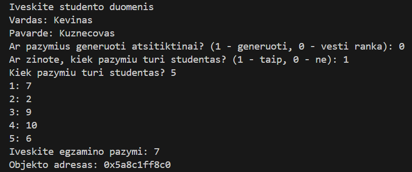

# Studentų programos testavimas – v0.3

## Testavimo sistema

Šiame tyrime programos veikimas buvo matuojamas naudojant šią aparatūrą:

| Komponentas           | Aprašymas                                                      |
|-----------------------|---------------------------------------------------------------|
| **CPU**               | AMD Ryzen 7 PRO 4750U with Radeon Graphics (1.70 GHz)         |
| **RAM**               | 16.0 GB (15.3 GB usable)                                      |
| **Diskas**            | SSD                                                            |
| **Operacinė sistema** | Windows 10                                                    |

---

##  Testavimo metodika

1. Programos veikimas buvo tikrinamas tiek su `std::vector<Studentas>`, tiek su `std::list<Studentas>`.  
2. Rankinio įvedimo metu programa išveda kiekvieno **Studentas** objekto atminties adresą.

3. Matavimai apėmė:
   - studentų nuskaitymą iš pradinio failo.
   - studentų rikiavimą didėjimo tvarka.
   - studentų padalijimą į skirtingus failus.
   - duomenų įrašymą į failus.
   - bendrą programos vykdymo laiką.  
4. Kiekvienam failui buvo fiksuojami laikai ir apskaičiuotas kelių bandymų vidurkis, kad būtų patikimesni rezultatai.

##  Rezultatai – std::list<Studentas>

Toliau pateikiami testavimo rezultatai, kai konteineriui buvo naudojamas **std::list<Studentas>**.  
Kiekvienas testas buvo kartojamas penkis kartus, o lentelėje pateikti vidurkiai sekundėmis.

| Failas             | Nuskaitymas (s) | Rikiavimas (s) | Padalijimas (s) | Įrašymas (s) | **Bendras laikas (s)** |
| ------------------ | --------------- | -------------- | --------------- | ------------ | ---------------------- |
| studentai_1000     | 0.007           | 0.000          | 0.001           | 0.008        | **0.017**              |
| studentai_10000    | 0.034           | 0.003          | 0.012           | 0.067        | **0.116**              |
| studentai_100000   | 0.327           | 0.056          | 0.133           | 0.611        | **1.127**              |
| studentai_1000000  | 3.379           | 0.970          | 1.411           | 6.839        | **12.620**             |
| studentai_10000000 | 34.220          | 15.929         | 14.842          | 51.843       | **116.233**            |

---

### Pastabos

- Matyti, kad programos laikas didėja beveik tiesiškai didėjant įrašų kiekiui, tačiau po 1 milijono įrašų galime pastėbėti, kad ilgiausiai trunka įrašymas ir nuskaitymas.
- Didžiausia laiko dalis 100 tūkst. įrašų ir daugiau tenka failo **įrašymui** – šis procesas tampa pagrindiniu.
- **list** konteinerio atveju **rikiavimas ir padalijimas** trunka žymiai ilgiau nei mažesniuose failuose, nes elementų prieigos sudėtingumas yra didesnis nei vector.

---

##  Rezultatai – std::vector<Studentas>

Toliau pateikiami testavimo rezultatai, kai konteineriui buvo naudojamas **std::vector<Studentas>**.  
Kiekvienas testas buvo kartojamas penkis kartus, o lentelėje pateikti vidurkiai sekundėmis.

| Failas             | Nuskaitymas (s) | Rikiavimas (s) | Padalijimas (s) | Įrašymas (s) | **Bendras laikas (s)** |
| ------------------ | --------------- | -------------- | --------------- | ------------ | ---------------------- |
| studentai_1000     | 0.005           | 0.001          | 0.000           | 0.009        | **0.015**              |
| studentai_10000    | 0.022           | 0.018          | 0.005           | 0.066        | **0.110**              |
| studentai_100000   | 0.203           | 0.235          | 0.047           | 0.623        | **1.106**              |
| studentai_1000000  | 1.996           | 3.073          | 0.513           | 5.796        | **11.574**             |
| studentai_10000000 | 21.078          | 38.997         | 4.927           | 48.976       | **113.979**            |

---

### Pastabos

- vector konteinerio atveju **rikiavimas** vyksta žymiai greičiau nei list, ypač dideliuose failuose, nes elementai yra saugomi **tęstinėje atminties vietoje** ir std::sort gali efektyviai naudoti indeksus.
- Ilgiausiai ir toliau užtrunka nuskaitymas bei įrašymas į failą.
- Skirtumas tarp vector ir list konteinerių ryškiausias **rikiavimo ir padalijimo** etapuose, ypač didesniuose failuose.

---
## Palyginimas
Kitoje dalyje bus pateiktas tiesioginis vector vs list palyginimas lentelėse ir grafikuose, kad būtų galima aiškiai vizualizuoti spartos skirtumus.
